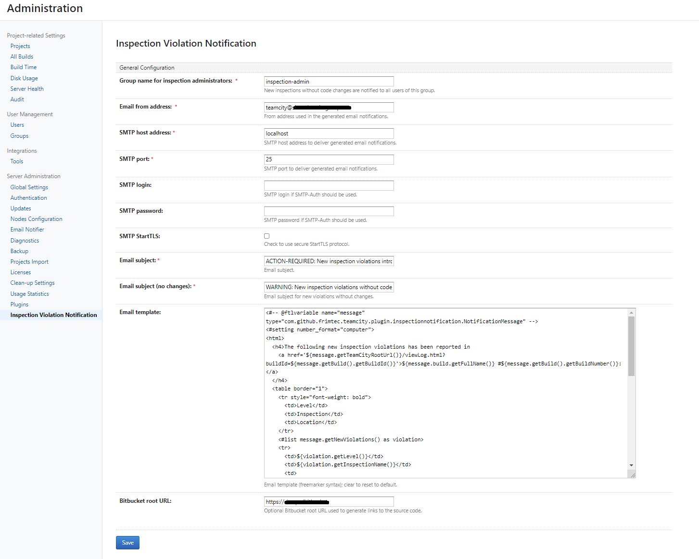
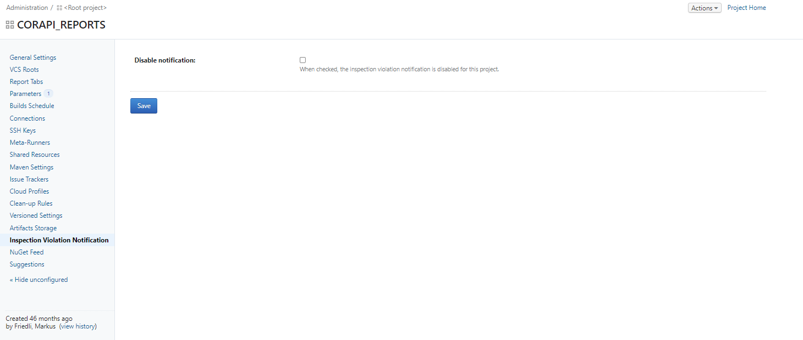

# TeamCity-Inspection-Notification-Plugin [![setup automated][gitpod-shield]][gitpod]
[![JetBrains Plugins][jetbrains-plugin-release-shield]][jetbrains-plugin]
![Plugin Downloads][jetbrains-plugin-download-shield]

![Project Maintenance][maintenance-shield]
[![Code Coverage][codecov-shield]][codecov]
[![License][license-shield]][license]

[![Build Status][build-status-shield]][build-status]
[![Deploy Status][deploy-status-shield]][deploy-status]

TeamCity server-side plugin that notifies committers about newly introduced code inspection violations.

# Installation

Install it directly from JetBrains TeamCity-Plugin-Repository [inspection-violation-notification][jetbrains-plugin].

# Configuration

## General settings
On TeamCity, as an administrator, configure the plugin on the administration tab "Inspection Violation Notification".

## Project level settings
On project level the noftification mails can be disabled for a single project if required:

[gitpod-shield]: https://img.shields.io/badge/Gitpod-ready_to_code-orange?logo=gitpod
[gitpod]: https://gitpod.io/from-referrer/
[maintenance-shield]: https://img.shields.io/maintenance/yes/2022.svg
[license-shield]: https://img.shields.io/github/license/frimtec/teamcity-inspection-notification-plugin.svg
[license]: https://opensource.org/licenses/Apache-2.0
[build-status-shield]: https://github.com/frimtec/teamcity-inspection-notification-plugin/workflows/Build/badge.svg
[build-status]: https://github.com/frimtec/teamcity-inspection-notification-plugin/actions?query=workflow%3ABuild
[deploy-status-shield]: https://github.com/frimtec/teamcity-inspection-notification-plugin/workflows/Deploy%20release/badge.svg
[deploy-status]: https://github.com/frimtec/teamcity-inspection-notification-plugin/actions?query=workflow%3A%22Deploy+release%22
[codecov-shield]: https://codecov.io/gh/frimtec/teamcity-inspection-notification-plugin/branch/master/graph/badge.svg?token=PA2AUVHJNI
[codecov]: https://codecov.io/gh/frimtec/teamcity-inspection-notification-plugin
[jetbrains-plugin-release-shield]: https://img.shields.io/jetbrains/plugin/v/12382
[jetbrains-plugin-download-shield]: https://img.shields.io/jetbrains/plugin/d/12382
[jetbrains-plugin]: https://plugins.jetbrains.com/plugin/12382-inspection-violation-notification
