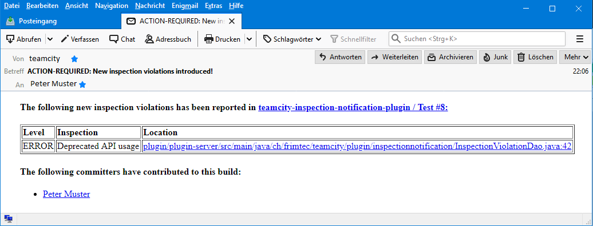

# TeamCity-Inspection-Notification-Plugin
 
 

TeamCity server-side plugin that notifies committers about newly introduced code inspection violations.

# Installation

Install it directly from JetBrains TeamCity-Plugin-Repository [inspection-violation-notification](https://plugins.jetbrains.com/plugin/12382-inspection-violation-notification).

Compatibility:
* Release 1.0 was tested against TeamCity 2018.2 and 2019.1.

# Configuration

On TeamCity, as an administrator, configure the plugin on the administration tab "Inspection Violation Notification".

# Future Improvements

* Replace own email SMTP configuration.
* Replace use of deprecated SQLRunner API.
